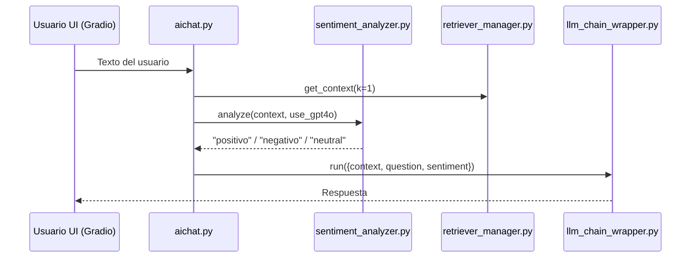

# SCRUM‑13 · Procesamiento y clasificación emocional de texto

## Historia de Usuario

**Como** usuario del chatbot (*Chatbot‑Emociones*)
**Quiero** que el sistema detecte si el texto que escribo expresa una emoción **positiva, negativa o neutral**
**Para** obtener una respuesta adaptada a mi estado de ánimo y mejorar la empatía de la conversación.

---

## Tareas Técnicas

1. **Implementar lógica GPT‑4o**

   * Añadir verificación de `OPENAI_API_KEY`.
   * Prompt: `"Analiza el sentimiento del siguiente texto y responde solo con 'positivo', 'negativo' o 'neutral'…"`.
   * Parsear respuesta (trim, lowercase).
2. **Back‑off a modelo local**

   * Integrar HuggingFace pipeline (`sentiment-analysis`) con `distilbert-base-uncased-finetuned-sst-2-english` o mantener MiniLM.
3. **Refactor en `sentiment_analyzer.py`**

   * Método `analyze(text: str, use_gpt4o: bool=False, summarize: bool=False)`.
   * Logs con `rich` para nivel INFO/ERROR.
4. **Unit tests** (`tests/test_sentiment_analyzer.py`)

   * Mock API OpenAI.
   * Casos bordes: string vacío, emojis, spam.
5. **Integración en flujo principal** (`aichat.py`)

   * Llamar antes de `llm_chain_wrapper.run()` y pasar etiqueta al prompt.
6. **Actualizar UI Gradio**

   * Mostrar chip coloreado (verde/rojo/gris) con el resultado.
7. **Benchmark & métrica**

   * Script `notebooks/eval_sentiment.ipynb` para validación (precision, recall).

---

## Diseño y Flujo



---

## Snippet clave (`sentiment_analyzer.py`)

```python
if use_gpt4o:
    if not self.openai_api_key:
        logger.error("[bold red]OpenAI API key is required for GPT‑4o sentiment analysis.[/bold red]")
        raise ValueError("OpenAI API key is required for GPT‑4o sentiment analysis.")
    prompt = (
        "Analiza el sentimiento del siguiente texto y responde solo con 'positivo', 'negativo' o 'neutral':\n\n{text}"
    )
    client = openai.OpenAI(api_key=self.openai_api_key)
    response = client.chat.completions.create(
        model="gpt-4o",
        messages=[{"role": "user", "content": prompt}]
    )
    sentiment = response.choices[0].message.content.strip().lower()
    logger.info(f"[bold green]Sentiment analysis (GPT‑4o) completed: {sentiment}[/bold green]")
    return sentiment
```

---

## Pruebas de Aceptación

```gherkin
Feature: Clasificación emocional
  Scenario: Usuario ingresa texto negativo
    Given el chatbot está desplegado
    When el usuario escribe "Estoy muy decepcionado de tu servicio"
    Then el sistema muestra la etiqueta "negativo" en menos de 3 segundos
```

---

## Referencias

* OpenAI Chat Completions API (GPT‑4o).
* HuggingFace Transformers – Sentiment Analysis Pipelines.
* Paper: *BERT – Pre‑training of Deep Bidirectional Transformers for Language Understanding*.
* Métrica ROUGE‑L para resumen (relevante para integración futura con SCRUM‑42).
